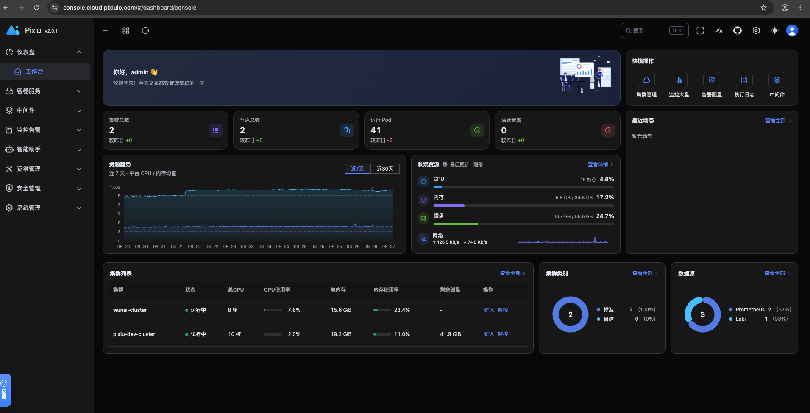
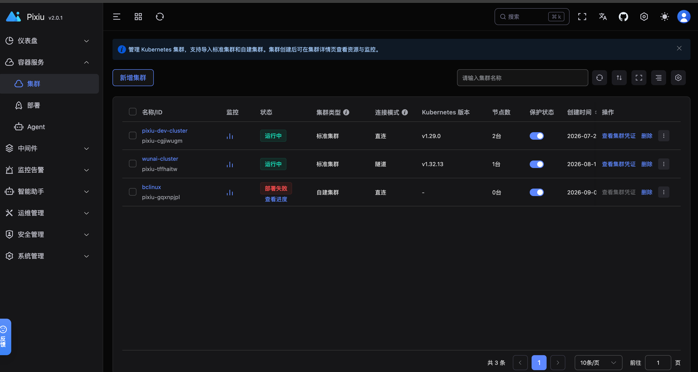
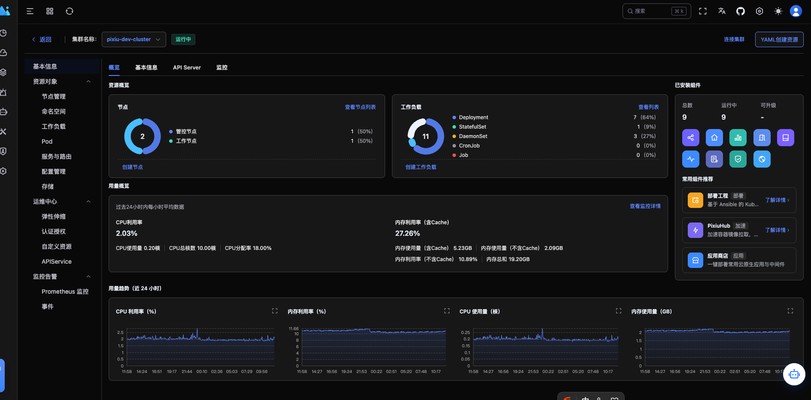
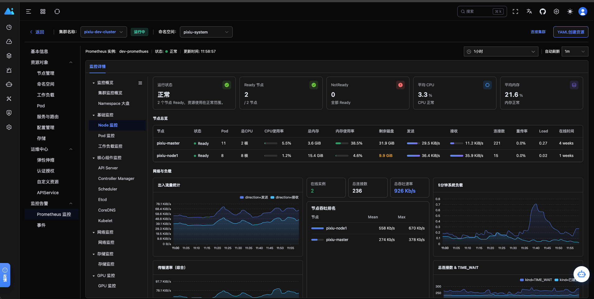
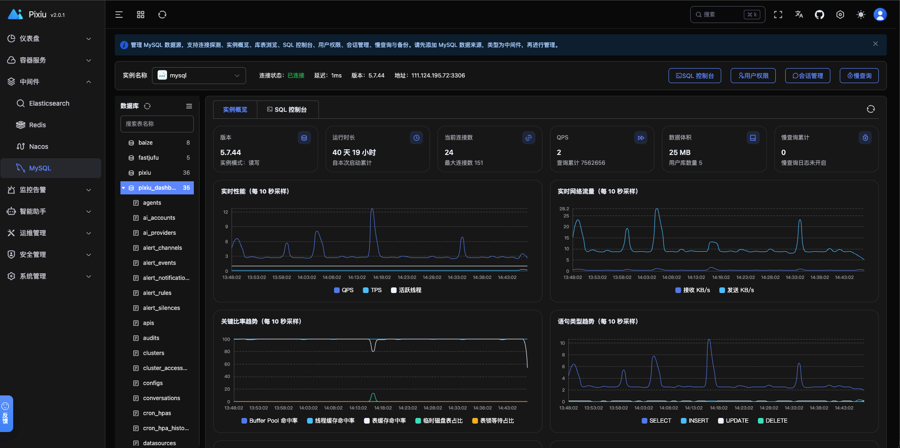
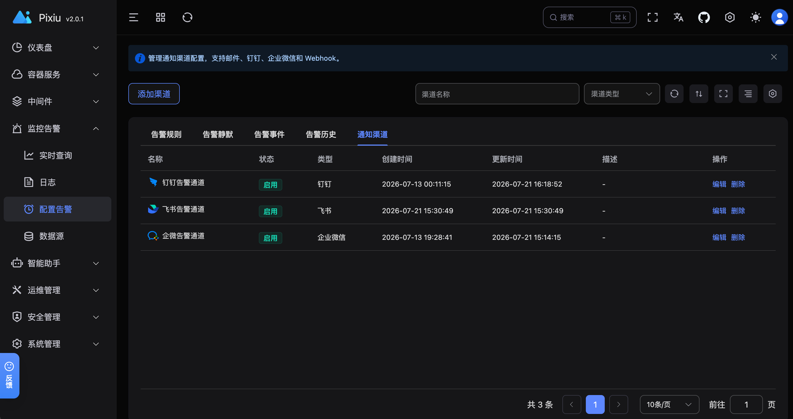

# Pixiu

Pixiu 是一个易用、可扩展的开源云原生容器管理平台。

Pixiu 融合了传统 Web 控制台 / 仪表盘"列表与查看资源"的能力，并在此之上提供集群部署、多集群管理、中间件管理等增强功能。

![Build Status][build-url]
[![Release][release-image]][release-url]
[![License][license-image]][license-url]

## 特性

- 厂商无关 / 通用的 Kubernetes 管理界面
- 支持集群内部署，也支持本地手动 / docker-compose 部署
- 多集群管理
- 通过部署计划以页面"点点点"的方式创建 Kubernetes 集群
- 集群概览：CPU / 内存 / 网络 / 集群服务等监控信息
- 工作负载管理：Deployment、Pod 等
- 中间件管理：MySQL、PostgreSQL、Redis、Nacos、Elasticsearch
- 界面操作随用户角色收敛（无权限则不展示 / 禁止相应操作）
- 审计功能
- 增强代理：DeployAgent / ClusterAgent 支持网络隔离环境
- 简洁现代的 UI

## 截图

<table>
  <tr>
    <th width="50%">首页</th>
    <th width="50%">多集群管理</th>
  </tr>
  <tr>
    <td width="50%"></td>
    <td width="50%"></td>
  </tr>
  <tr>
    <th width="50%">集群基本信息</th>
    <th width="50%">集群监控</th>
  </tr>
  <tr>
    <td width="50%"></td>
    <td width="50%"></td>
  </tr>
  <tr>
    <th width="50%">MySQL 中间件</th>
    <th width="50%">监控告警</th>
  </tr>
  <tr>
    <td width="50%"></td>
    <td width="50%"></td>
  </tr>
</table>

## 快速开始

- 手动安装：[install.md](install.md)
- Kubernetes 安装：[deploy/pixiu](deploy/pixiu/README.md)
- docker-compose 安装：[deploy/docker-compose](deploy/docker-compose/README.md)
- 离线安装：[deploy/offline](deploy/offline/README.md)
- 升级：[deploy/upgrade](deploy/upgrade/README.md)

### 访问与权限

Pixiu 基于角色对资源访问进行控制。若使用权限受限的账号登录，可能无法查看或操作相应的集群资源，请先在"账号 / 角色"中分配所需权限。

## 增强代理

- [DeployAgent](deploy/deploy-agent/README.md)：边缘节点在网络隔离的情况下通过驱动完成 Kubernetes 集群部署。
- [ClusterAgent](deploy/cluster-agent/README.md)：通过轻量 Sidecar 使控制面能够访问网络隔离环境下的集群 kube-apiserver。

## 开发文档

- [开发文档](docs/README.md)
- [API 说明](docs/apis.md)
- [数据库表结构](docs/sql.md)

## 参与交流

- [go-learning](https://github.com/caoyingjunz/go-learning)：Go 学习分享
- 搜索微信号 `yingjuncz`，备注（pixiu），验证通过会加入群聊
- [bilibili](https://space.bilibili.com/3493104248162809?spm_id_from=333.1007.0.0)：技术分享

## 常见问题

- [FAQ](faq/README.md)
- [etcd 指标为空](faq/etcd-metrics-empty.md)

## 许可证

Pixiu 基于 Apache 2.0 许可证发布。

Copyright 2019 caoyingjun (cao.yingjunz@gmail.com) Apache License 2.0

[build-url]: https://github.com/caoyingjunz/pixiu/actions/workflows/ci.yml/badge.svg
[release-image]: https://img.shields.io/badge/release-download-orange.svg
[release-url]: https://www.apache.org/licenses/LICENSE-2.0.html
[license-image]: https://img.shields.io/badge/license-Apache%202-4EB1BA.svg
[license-url]: https://www.apache.org/licenses/LICENSE-2.0.html
